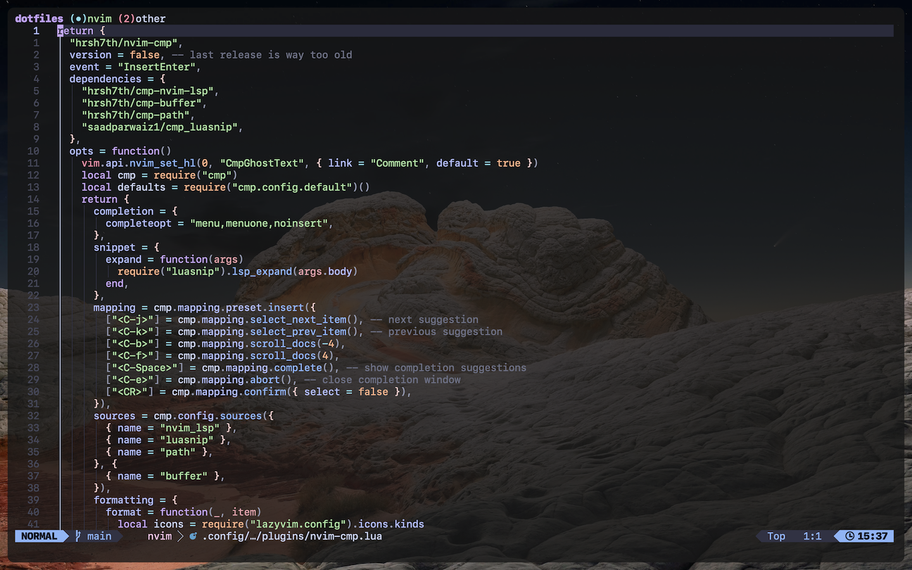

# Sascha Tegtmeier's dotfiles

Collection of my dotfiles and other configurations. :)

## Software

### Terminal

- Emulator: [Alacritty](https://alacritty.org/)
- Shell: [Zsh](https://www.zsh.org/)
- Editor: [Neovim](https://neovim.io/)
- Multiplexer: [tmux](https://github.com/tmux/tmux)
- Font: [SFMono Nerd Font](https://github.com/epk/SF-Mono-Nerd-Font)
- Colors: [Catppuccin (Flavour: Mocha)](https://github.com/catppuccin)

### Navigation

- Window Management: [yabai](https://github.com/koekeishiya/yabai) + [skhd](https://github.com/koekeishiya/skhd)

### Package Managers

- macOS: [Homebrew](https://brew.sh/)
- npm: [pnpm](https://pnpm.io/)

### Applications

- Browser: [Arc](https://arc.net/)
- Task Manager: [Things](https://culturedcode.com/things/)
- Project Management: [Linear](https://linear.app/)
- Notes/Writing: [Obsidian](https://obsidian.md/)
- Password Management: [1Password](https://1password.com/de)

## Hardware

- Laptop: MacBook Pro (13-inch, 2016)
- Keyboard: NuPhy Air60 v1
- Mouse: Logitech MX Master 3
